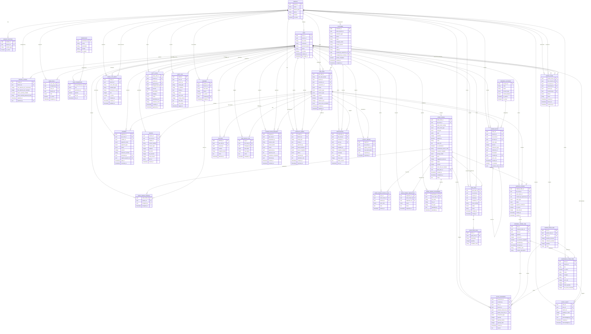

```mermaid
erDiagram
 
  BRANCH {
    uuid branch_id PK
    string name
    enum branch_type
    string phone
    string location
    boolean is_active
  }
 
  BRANCH_SECTION {
    uuid section_id PK
    uuid branch_id FK
    string section_type
    boolean is_active
  }
 
  BRANCH_CONFIG {
    uuid config_id PK
    uuid branch_id FK
    integer min_advance_pct_customized
    integer min_advance_pct_standard
    boolean stock_override_enabled
    string stock_override_password_hash
    timestamp updated_at
    uuid updated_by FK
  }
 
  USER {
    uuid user_id PK
    uuid branch_id FK
    string full_name
    string username
    string password_hash
    string phone
    boolean is_active
    timestamp created_at
    timestamp last_login_at
  }
 
  USER_ROLE {
    uuid user_role_id PK
    uuid assigned_by FK
    uuid user_id FK
    uuid branch_id FK
    enum role
    boolean is_active
    timestamp assigned_at
  }
 
  PERMISSION {
    uuid permission_id PK
    string action
    string description
    string module
    boolean is_system
  }
 
  ROLE_PERMISSION {
    uuid role_permission_id PK
    enum role
    uuid permission_id FK
    boolean granted
    uuid set_by FK
    timestamp set_at
  }
 
  WORKER {
    uuid worker_id PK
    uuid branch_id FK
    string full_name
    string phone
    boolean is_active
    uuid created_by FK
    timestamp created_at
  }
 
  CUSTOMER {
    uuid customer_id PK
    uuid home_branch_id FK
    enum customer_type
    string phone
    string name
    string company_name
    string contact_person
    string email
    string address
    uuid created_by_supervisor_id FK
    uuid completed_by_cashier_id FK
    boolean profile_completed
    timestamp created_at
    timestamp completed_at
  }
 
  JOB_CARD {
    uuid job_card_id PK
    string job_card_number
    uuid branch_id FK
    uuid customer_id FK
    uuid supervisor_id FK
    enum status
    enum section_type
    enum service_type
    integer version
    boolean is_legacy
    integer balance_due
    enum actor_role_at_creation
    timestamp created_at
    timestamp updated_at
  }
 
  WORK_ORDER {
    uuid work_order_id PK
    uuid job_card_id FK
    string work_order_number
    enum work_order_type
    enum sub_type
    jsonb spec
    integer quantity
    decimal weight_kg
    string color
    text work_info
    boolean is_customized
    string customized_reason_code
    boolean customer_supplied
    enum pricing_model
    integer price
    integer suggested_advance
    enum status
    integer version
    enum actor_role_at_creation
    uuid gate_pass_id FK
    timestamp created_at
    timestamp completed_at
    text notes
  }
 
  WORK_ORDER_WORKER {
    uuid work_order_id FK
    uuid worker_id FK
    uuid assigned_by FK
    timestamp assigned_at
  }
 
  WORK_ORDER_STATUS_NOTE {
    uuid note_id PK
    uuid work_order_id FK
    uuid written_by FK
    enum actor_role
    text note
    timestamp written_at
  }
 
  WORK_ORDER_INSPECTION {
    uuid inspection_id PK
    uuid work_order_id FK
    uuid supervisor_id FK
    enum result
    text notes
    timestamp inspected_at
  }
 
  WORK_ORDER_ATTACHMENT {
    uuid attachment_id PK
    uuid work_order_id FK
    string file_name
    string file_url
    string file_type
    uuid uploaded_by FK
    timestamp uploaded_at
  }
 
  PRICE_LIST_ENTRY {
    uuid entry_id PK
    uuid branch_id FK
    string work_order_type
    string material_type
    string thickness_or_size
    integer rate
    boolean is_active
    uuid created_by FK
    timestamp created_at
    timestamp updated_at
  }
 
  MATERIAL_ORDER {
    uuid material_order_id PK
    uuid job_card_id FK
    uuid work_order_id FK
    uuid created_by_supervisor_id FK
    enum order_type
    enum status
    boolean payment_confirmed
    boolean is_issued
    integer total_amount
    timestamp created_at
    timestamp issued_at
  }
 
  MATERIAL_ORDER_LINE {
    uuid line_id PK
    uuid material_order_id FK
    uuid item_id FK
    integer quantity
    integer unit_price
    boolean is_customer_supplied
    uuid accepted_by FK
    timestamp accepted_at
    string condition_note
    string custom_description
  }
 
  HARDWARE_STORE_ITEM {
    uuid item_id PK
    uuid branch_id FK
    string sku
    boolean is_active
    string name
    string category
    string unit
    integer unit_cost
    integer price
    integer stock_quantity
    integer low_stock_threshold
  }
 
  STOCK_MOVEMENT {
    uuid movement_id PK
    uuid created_by FK
    uuid item_id FK
    uuid branch_id FK
    uuid material_order_line_id FK
    uuid goods_issue_line_id FK
    enum movement_type
    integer quantity
    integer quantity_before
    integer quantity_after
    timestamp moved_at
    text reason
  }
 
  STOCK_ALERT {
    uuid alert_id PK
    uuid item_id FK
    uuid branch_id FK
    integer quantity_at_alert
    enum status
    uuid acknowledged_by FK
    timestamp created_at
    timestamp acknowledged_at
  }
 
  GOODS_ISSUE {
    uuid goods_issue_id PK
    uuid from_branch_id FK
    uuid to_branch_id FK
    uuid requested_by FK
    uuid issued_by FK
    uuid confirmed_by FK
    enum status
    string notes
    timestamp created_at
    timestamp issued_at
    timestamp confirmed_at
  }
 
  GOODS_ISSUE_LINE {
    uuid line_id PK
    uuid goods_issue_id FK
    uuid item_id FK
    integer quantity_received
    string reference_number
    integer quantity
    string notes
  }
 
  PAYMENT {
    uuid payment_id PK
    uuid job_card_id FK
    uuid cashier_id FK
    enum payment_mode
    enum payment_type
    enum status
    integer amount
    string reference_number
    uuid reversed_by FK
    uuid original_payment_id FK
    timestamp paid_at
    timestamp reversed_at
  }
 
  INVOICE {
    uuid invoice_id PK
    uuid job_card_id FK
    uuid cashier_id FK
    string invoice_number
    enum invoice_type
    integer subtotal
    integer tax_rate
    integer tax_amount
    integer total_amount
    string pdf_url
    timestamp issued_at
  }
 
  FINANCIAL_ACCOUNT {
    uuid account_id PK
    string code
    string name
    enum account_type
    enum normal_balance
    boolean is_system
    boolean is_active
  }
 
  LEDGER_ENTRY {
    uuid entry_id PK
    uuid branch_id FK
    uuid job_card_id FK
    uuid account_id FK
    enum entry_type
    integer amount
    string reference_type
    uuid reference_id
    text description
    uuid created_by FK
    enum actor_role
    timestamp created_at
    boolean is_reversal
    uuid reverses_entry_id FK
  }
 
  DELIVERY {
    uuid delivery_id PK
    uuid job_card_id FK
    uuid issued_by FK
    enum method
    string recipient_name
    text notes
    timestamp delivered_at
  }
 
  JOB_STATUS_LOG {
    uuid log_id PK
    uuid job_card_id FK
    uuid changed_by FK
    enum old_status
    enum new_status
    text notes
    timestamp changed_at
  }
 
  CANCELLATION_REQUEST {
    uuid request_id PK
    uuid job_card_id FK
    uuid requested_by FK
    string reason_code
    text reason_detail
    enum status
    uuid approved_by FK
    text approval_note
    boolean materials_consumed
    uuid attested_by FK
    timestamp created_at
    timestamp resolved_at
  }
 
  CONFLICT_QUEUE {
    uuid conflict_id PK
    uuid branch_id FK
    string entity_type
    uuid entity_id
    uuid reported_by FK
    jsonb client_snapshot
    jsonb server_snapshot
    enum status
    uuid resolved_by FK
    text resolution_note
    timestamp created_at
    timestamp resolved_at
  }
 
  PETTY_CASH {
    uuid petty_cash_id PK
    uuid branch_id FK
    uuid cashier_id FK
    uuid approved_by FK
    uuid related_user_id FK
    integer amount
    text description
    enum category
    enum status
    string attachment_url
    string reference_note
    timestamp created_at
    timestamp approved_at
  }
 
  GATE_PASS {
    uuid gate_pass_id PK
    uuid job_card_id FK
    uuid branch_id FK
    uuid issued_by FK
    uuid customer_id FK
    string pass_number
    enum status
    string notes
    timestamp created_at
    timestamp closed_at
  }
 
  GATE_PASS_ITEM {
    uuid item_id PK
    uuid gate_pass_id FK
    string description
    integer quantity
    string condition_note
  }
 
  NOTIFICATION {
    uuid notification_id PK
    uuid job_card_id FK
    uuid customer_id FK
    uuid sent_by FK
    enum channel
    string template_id
    string recipient_contact
    text message
    enum status
    integer retry_count
    text failure_reason
    timestamp sent_at
  }
 
  AUDIT_LOG {
    uuid audit_id PK
    uuid user_id FK
    uuid branch_id FK
    string entity_type
    string ip_address
    uuid entity_id
    string action
    enum actor_role
    integer entity_version
    text old_value
    text new_value
    timestamp logged_at
  }
 
  LEGACY_IMPORT {
    uuid import_id PK
    uuid job_card_id FK
    string legacy_reference
    jsonb raw_import_data
    uuid imported_by FK
    timestamp imported_at
  }
 
  %% ── BRANCH relationships ─────────────────────────────
  BRANCH ||--o{ BRANCH_SECTION : "has"
  BRANCH ||--|| BRANCH_CONFIG : "configured by"
  BRANCH ||--o{ USER : "employs"
  BRANCH ||--o{ USER_ROLE : "scoped to"
  BRANCH ||--o{ WORKER : "has workers"
  BRANCH ||--o{ JOB_CARD : "owns"
  BRANCH ||--o{ PETTY_CASH : "tracks"
  BRANCH ||--o{ HARDWARE_STORE_ITEM : "stocks"
  BRANCH ||--o{ STOCK_MOVEMENT : "records"
  BRANCH ||--o{ STOCK_ALERT : "receives"
  BRANCH ||--o{ GATE_PASS : "issues"
  BRANCH ||--o{ AUDIT_LOG : "records"
  BRANCH ||--o{ GOODS_ISSUE : "sends from"
  BRANCH ||--o{ GOODS_ISSUE : "receives to"
  BRANCH ||--o{ CUSTOMER : "home branch"
  BRANCH ||--o{ PRICE_LIST_ENTRY : "overrides"
  BRANCH ||--o{ CONFLICT_QUEUE : "has"
  BRANCH ||--o{ LEDGER_ENTRY : "records"
 
  %% ── USER relationships ───────────────────────────────
  USER ||--o{ USER_ROLE : "has roles"
  USER ||--o{ JOB_CARD : "supervises"
  USER ||--o{ PAYMENT : "processes"
  USER ||--o{ PAYMENT : "reverses"
  USER ||--o{ INVOICE : "generates"
  USER ||--o{ PETTY_CASH : "records"
  USER ||--o{ PETTY_CASH : "salary ref"
  USER ||--o{ JOB_STATUS_LOG : "triggers"
  USER ||--o{ GATE_PASS : "creates"
  USER ||--o{ AUDIT_LOG : "generates"
  USER ||--o{ MATERIAL_ORDER : "places"
  USER ||--o{ GOODS_ISSUE : "requests"
  USER ||--o{ GOODS_ISSUE : "issues"
  USER ||--o{ GOODS_ISSUE : "confirms"
  USER ||--o{ WORK_ORDER_INSPECTION : "inspects"
  USER ||--o{ WORK_ORDER_ATTACHMENT : "uploads"
  USER ||--o{ STOCK_ALERT : "acknowledges"
  USER ||--o{ DELIVERY : "issues"
  USER ||--o{ NOTIFICATION : "sends"
  USER ||--o{ WORKER : "created by"
  USER ||--o{ WORK_ORDER_STATUS_NOTE : "writes"
  USER ||--o{ WORK_ORDER_WORKER : "assigns"
  USER ||--o{ ROLE_PERMISSION : "configured by"
  USER ||--o{ LEDGER_ENTRY : "creates"
  USER ||--o{ PRICE_LIST_ENTRY : "manages"
  USER ||--o{ CANCELLATION_REQUEST : "requests"
  USER ||--o{ CANCELLATION_REQUEST : "approves"
  USER ||--o{ CONFLICT_QUEUE : "reports"
  USER ||--o{ CONFLICT_QUEUE : "resolves"
  USER ||--o{ LEGACY_IMPORT : "imports"
  USER ||--o{ BRANCH_CONFIG : "updates"
 
  %% ── PERMISSION / RBAC ────────────────────────────────
  PERMISSION ||--o{ ROLE_PERMISSION : "assigned via"
 
  %% ── CUSTOMER relationships ───────────────────────────
  CUSTOMER ||--o{ JOB_CARD : "has"
  CUSTOMER ||--o{ NOTIFICATION : "receives"
  CUSTOMER ||--o{ GATE_PASS : "holds"
 
  %% ── JOB_CARD relationships ───────────────────────────
  JOB_CARD ||--o{ WORK_ORDER : "contains"
  JOB_CARD ||--o{ MATERIAL_ORDER : "includes"
  JOB_CARD ||--o{ INVOICE : "has invoices"
  JOB_CARD ||--o{ PAYMENT : "receives"
  JOB_CARD ||--o{ JOB_STATUS_LOG : "logs"
  JOB_CARD ||--o{ NOTIFICATION : "triggers"
  JOB_CARD ||--o{ DELIVERY : "fulfilled by"
  JOB_CARD ||--o{ LEDGER_ENTRY : "tracked in"
  JOB_CARD ||--o{ CANCELLATION_REQUEST : "cancelled via"
  JOB_CARD ||--o{ CONFLICT_QUEUE : "conflicts in"
  JOB_CARD ||--o| LEGACY_IMPORT : "imported as"
 
  %% ── WORK_ORDER relationships ─────────────────────────
  WORK_ORDER ||--o{ WORK_ORDER_WORKER : "assigned to"
  WORK_ORDER ||--o{ WORK_ORDER_STATUS_NOTE : "has notes"
  WORK_ORDER ||--o{ WORK_ORDER_INSPECTION : "inspected via"
  WORK_ORDER ||--o{ WORK_ORDER_ATTACHMENT : "has files"
  WORK_ORDER ||--o{ MATERIAL_ORDER : "requires"
  WORK_ORDER ||--o{ STOCK_MOVEMENT : "triggers"
  WORK_ORDER }o--o| GATE_PASS : "customer supplied via"
 
  %% ── WORKER relationships ─────────────────────────────
  WORKER ||--o{ WORK_ORDER_WORKER : "works on"
 
  %% ── PRICE LIST ───────────────────────────────────────
  PRICE_LIST_ENTRY }o--o| BRANCH : "branch override"
 
  %% ── MATERIAL ORDER relationships ─────────────────────
  MATERIAL_ORDER ||--o{ MATERIAL_ORDER_LINE : "contains"
  MATERIAL_ORDER_LINE ||--|| HARDWARE_STORE_ITEM : "references"
  MATERIAL_ORDER_LINE ||--o{ STOCK_MOVEMENT : "causes"
 
  %% ── GOODS ISSUE relationships ────────────────────────
  GOODS_ISSUE ||--o{ GOODS_ISSUE_LINE : "contains"
  GOODS_ISSUE_LINE ||--|| HARDWARE_STORE_ITEM : "references"
  GOODS_ISSUE_LINE ||--o{ STOCK_MOVEMENT : "creates"
 
  %% ── INVENTORY relationships ──────────────────────────
  HARDWARE_STORE_ITEM ||--o{ STOCK_MOVEMENT : "tracks"
  HARDWARE_STORE_ITEM ||--o{ STOCK_ALERT : "triggers"
 
  %% ── FINANCIAL LEDGER ─────────────────────────────────
  FINANCIAL_ACCOUNT ||--o{ LEDGER_ENTRY : "categorises"
  LEDGER_ENTRY }o--o| LEDGER_ENTRY : "reverses"
 
  %% ── GATE PASS ────────────────────────────────────────
  GATE_PASS ||--o{ GATE_PASS_ITEM : "lists"
```